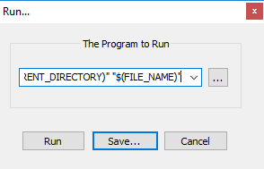

The `ExecuteBatch.bat` script is useful to execute other batch
scripts in [Notepad++](https://notepad-plus-plus.org/)

# Use-case
When you develop a windows batch script in Notepad++ you want to
execute it directly via one key-press (e.g. F9)
The `ExecuteBatch.bat` script will
* execute your script (the currently open document in Notepadd++)
* show if your script worked or returned an error
* and finally (depending on a parameter) wait, exit or pause

# Installation/Configuration
Just save the file to your development machine and then configure
Notepad++ to execute it on a key-press: e.g. F9.

## Configure Run command
In Notepad++ press open the `Run...` dialogue:  
Press `F5` or select `Run` - `Run..` from the menu



In the `The Program to Run` field, enter the full path to the downloaded
 `ExecuteBatch.bat` script and append the Notepad++ parameters for the
  currently open file "$(CURRENT_DIRECTORY)" "$(FILE_NAME)":

Example:
```
C:\scripts\ExecuteBatch.bat "$(CURRENT_DIRECTORY)" "$(FILE_NAME)"
```
Note: you must of course replace `C:\scripts\` with the correct location
, where you downloaded the `ExecuteBatch.bat` script.

Then click `Save...` and assign the shortcut key:  


### ExitMode parameter
You can pass an optional ExitMode parameter to the script
```
C:\scripts\ExecuteBatch.bat "$(CURRENT_DIRECTORY)" "$(FILE_NAME)" [ExitMode]
```

`ExitMode` is optional and can have these values:

* `pause`: the script will wait for a key-press
* missing (DEFAULT): is the same as passing 10
* any number (e.g. `12`): the script will wait for the specified number of 
seconds and then exit. During the timeout, you can:
  * press any key to stop waiting immediately
  * or press CTRL-C to abort waiting (e.g. when you want to
  scroll the cmd-window or copy the window text, etc.)
